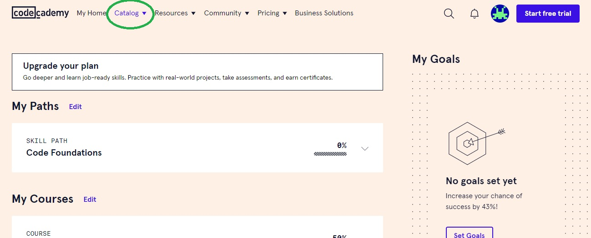

# How I learned how to code

## Why did you write this wtf

I get asked a lot how I learned how to code, given that I have a psychologist background. 

It is kind of common knowledge that you can just learn this over the internet. There's also a myth surrounding "programming" that it is too hard to learn for some. **It's not.** You end up googling a lot, reading a lot, and copy pasting a lot. You actually spend very little time writing, and it's easy once you get the gist of it.

  

## Disclaimer

I started learning Web development. The reason to learn 'programming' was that I wanted a real career and I found fun the little I knew about writing code. The reason to learn 'Web' was that I was running out of money and I didn't want to return to Venezuela defeated on my attempt to establish myself in Spain, and Web was the fastest way to land a job. What is this information good for? I don't know... Probably nothing... but this is what guided my choices at the time (December 2017).

## Steps I took to learn Web development.

I learned that web development involed HTML, CSS and Javascript / Typescript.

- HTML is a _Markup Language_ meaning that it provides structure, but it's not a 'programming language.'
- CSS means _Cascading Style Sheets_ and well, it provides styling. Making sites look good.
- Javascript is the real programming language. Typescript is just Javascript with super powers (so it's better, but is Javascript at the core).

I also had money issues at the moment, so I wasn't gonna pay anything to learn this. So this is what I did:

1- I went to the [codecademy website](https://www.codecademy.com) and I went to the Catalog button in the menu. In there I hit HTML & CSS (I figured those were easier than Javascript).

  

2- Inside the `HTML & CSS` subcategory, there were only three that caught my eye at the moment: `Basic HTML`, `Basic CSS` and `Build your first website` or something of the like. It has changed quite a bit now though. So now you just filter by `free` and then check the courses in there. I recommend currently:

> Learn HTML > Learn CSS: Introduction > Learn CSS > Learn Intermediate CSS > (Optionally) Learn CSS: Flexbox and Grid.

  

3 - Go to the `Javascript` subcategory and do the same with the filters. At the time there was only _Beginner_ and _Intermediate_ Javascript, and that's what I did. Nonetheless, again, it has changed quite a bit, so I recommend:

> Learn Javascript: Fundamentals > Learn Javascript > Learn Intermediate Javascript

> Learn Typescript: Fundamentals > Learn Typescript

  

This part will take like 90% of the time. HTML & CSS are a few hours, but JS and TS will take probably some days.

---

## Framework to land a job

After learning the fundamentals I learned one of the Frameworks that were getting jobs. These were `Angular` (from Google) and `React` (from Facebook). These are a bunch of pre-thought tools to make building websites with Typescript, HTML and CSS simpler. I learned Angular with a Free course (at the time) on Coursera.

Right now though, you could learn any even through Youtube. It doesn't matter as long as you're trying to build something with them. You could also learn in codecademy searching for React on the Javascript catalog. They have quite a few courses of it in there.

## And that's it

Yep, that's it. That's how I learned how to code. Also, learning how to code is a test of frustration. You have to learn a new way to read and solve problems and that takes some training. And as every skill, it's frustrating at first. You can get frustrated, you can learn how to code.

Also no, ChatGPT won't take our jobs anytime soon.

Thanks for reading this bullshit :)!